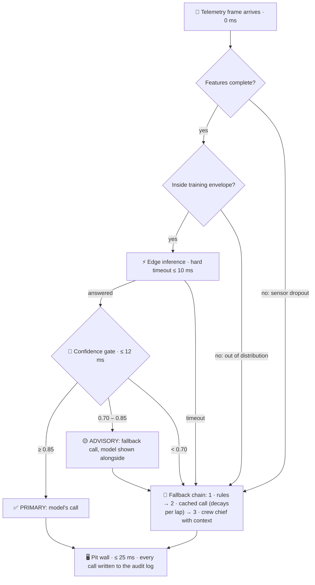

<div align="center">

# 🏁 race-speed-inference

**A pit call has to be on the wall in 25 ms. This is the system that makes sure it always is, even when the model can't be trusted.**

[](https://github.com/atonyhonesto/race-speed-inference/actions/workflows/tests.yml)


Companion code for my LinkedIn article<br>
**[AI/ML at Race Speed: Low-Latency Inference, Confidence Thresholds & Fallback Logic →](https://www.linkedin.com/pulse/aiml-race-speed-low-latency-inference-confidence-fallback-honesto-hwmbc/)**

</div>

---

## The idea in one paragraph

A model that answers in 8 ms is no use if the system around it takes 40. A model that says it's 91% sure but is right 60% of the time is worse than one that admits it doesn't know. This repo builds the parts that turn a model into something you could put on a pit wall: a **latency budget per stage**, a **hard timeout** on inference, a **dual-threshold confidence gate**, **calibration**, **drift detection**, a **three-tier fallback chain** and an **audit log** of every call. The model itself is deliberately small; the engineering is in everything around it.

## How a lap flows through it



## From article to code

| The article says | Where it lives |
|---|---|
| Five stages, each with a hard latency budget (10 / 12 / 18 / 25 ms) | [`pipeline.py`](racespeed/pipeline.py) – `STAGE_DEADLINES_MS`, cumulative deadlines from frame arrival |
| A slow model must not make the call late | [`pipeline.py`](racespeed/pipeline.py) – inference runs on a worker thread with `future.result(timeout=…)` |
| Dual-threshold gate: ≥0.85 primary, 0.70–0.85 advisory, <0.70 fallback | [`gate.py`](racespeed/gate.py) |
| Confidence without calibration is noise | [`calibration.py`](racespeed/calibration.py) – temperature scaling + expected calibration error |
| Distributional shift detection | [`drift.py`](racespeed/drift.py) – z-score envelope from training data |
| Four failure modes: missing features, timeout, low confidence, out-of-distribution | [`pipeline.py`](racespeed/pipeline.py) – each is a named `failure_mode` on the decision |
| Tier 1 rules → Tier 2 cached model → Tier 3 human override | [`fallback.py`](racespeed/fallback.py) |
| Every prediction logged with context for post-race analysis | `Decision.to_dict()` → one JSON line per lap |

## Run it

No dependencies beyond Python 3.10+.

```bash
git clone https://github.com/atonyhonesto/race-speed-inference.git
cd race-speed-inference
python demo.py            # simulate a 200-lap race with injected faults
python -m unittest -v     # 15 tests covering every gate zone and failure mode
```

Real output from `python demo.py`:

```text
Calibration (expected calibration error, lower is better)
  model as trained              ECE 0.025   (fitted T=1.05)
  simulated overconfident net   ECE 0.091
  ...after temperature scaling  ECE 0.017   (fitted T=3.20)

Race report: 200 laps, seed 2026
----------------------------------------------------
Who made the call             Laps     Share
PRIMARY_MODEL                  166     83.0%
ADVISORY                         4      2.0%
RULES                           10      5.0%
CACHED                          19      9.5%
HUMAN                            1      0.5%
----------------------------------------------------
Why the model was bypassed    Laps
LOW_CONFIDENCE                  14
OUT_OF_DISTRIBUTION              8
FEATURE_UNAVAILABLE              6
MODEL_TIMEOUT                    6
----------------------------------------------------
Primary-model accuracy on laps it owned: 91.6%
Latency  p50 0.07 ms   p99 9.20 ms   max 9.24 ms   (budget 25 ms)
Every call inside its stage deadlines: True
```

The demo injects three kinds of trouble so every path gets used: 3% sensor dropouts, 3% of inferences artificially stalled for 30 ms, and an eight-lap track-temperature spike the model never trained on. The stalled inferences are cut off at the deadline and handed to the fallback chain, which is why p99 sits just under 10 ms rather than at 30.

One lap from the audit log, when the heat spike pushed the model out of its envelope and neither the rules nor the cache had an answer:

```json
{
  "lap": 157,
  "action": "CREW_CHIEF_CALL",
  "source": "HUMAN",
  "failure_mode": "OUT_OF_DISTRIBUTION",
  "reasons": ["escalated: lap=157, drifted=['track_temp_c']"],
  "stage_ms": {"inference": 0.003, "gate": 0.003, "strategy": 0.022, "dashboard": 0.023},
  "deadline_met": true,
  "injected": ["heat_spike"]
}
```

## Design notes

- **The fallback is a feature, not a failure.** In the sample race the model owns 83% of laps. The other 17% still get a safe, explainable call on time, and each one records *why* the model was bypassed.
- **Calibration is shown on purpose.** Logistic regression is close to calibrated out of the box (T≈1.05), so the demo also sharpens the logits 3x to imitate an overconfident deep network. ECE jumps from 0.025 to 0.091, and temperature scaling (T≈3.2) brings it back to 0.017.
- **Deadlines are cumulative, not per-stage.** Every stage is measured from the moment the frame arrived, so slack early on can't hide a slow stage later.
- **The cache decays.** A trusted call from three laps ago is worth less than one from last lap; once it drops below the lower threshold it expires and the chain moves to the human.
- **Accuracy is capped by design.** The simulated "right call" has 8% label noise, standing in for strategists who'd disagree, so ~92% is the ceiling.

## What's simulated, and what production would swap in

| Here | On a real pit wall |
|---|---|
| Synthetic per-lap telemetry ([`telemetry.py`](racespeed/telemetry.py)) | ECU stream at ~10 ms intervals from 60+ sensors |
| Pure-Python logistic regression | INT8-quantized network on ONNX Runtime / TensorRT at the track edge |
| Thread-pool timeout | Dedicated inference process or accelerator queue with deadline scheduling |
| Z-score drift envelope | Conformal prediction / SafeML-style runtime monitors |
| JSON-lines audit log | Time-series store feeding post-race retraining |

## Project layout

```text
racespeed/
  telemetry.py     synthetic race + fault injection
  model.py         primary model (pure Python logistic regression)
  calibration.py   temperature scaling, expected calibration error
  drift.py         out-of-distribution detector
  gate.py          dual-threshold confidence gate
  fallback.py      rules → cached call → crew chief
  pipeline.py      deadlines, timeout, orchestration, Decision record
demo.py            race simulation + report
tests/             unit and end-to-end tests
```

---

<sub>Built by **Tony Honesto**, cloud & integration engineer with roots in IndyCar timing & scoring and NASCAR Race Control. More articles and companion repos: [github.com/atonyhonesto](https://github.com/atonyhonesto) · [LinkedIn](https://www.linkedin.com/in/tony-honesto-4195023)</sub>
